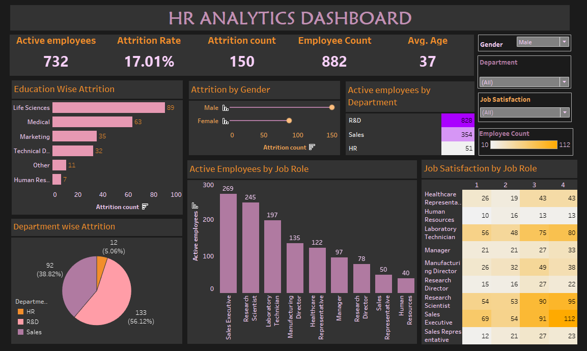

# HR-Analytics-Dashboard-using-Tableau-
An interactive Tableau dashboard analyzing employee attrition, demographics, job satisfaction, and department-wise insights to support HR decision-making.

# HR Analytics Dashboard (Tableau)

## 📊 Project Overview
This project focuses on analyzing HR data to understand employee attrition, workforce distribution, and job satisfaction across departments and roles. The interactive Tableau dashboard helps HR teams and management identify key trends and take data-driven decisions to improve employee retention and satisfaction.

---

## 🎯 Objectives
- Analyze employee attrition rate and attrition count
- Understand attrition trends by gender, education, and department
- Study active employee distribution across departments and job roles
- Evaluate job satisfaction levels by role
- Provide high-level HR KPIs for quick insights

---

## 📌 Key KPIs
- **Total Employees**
- **Active Employees**
- **Attrition Count**
- **Attrition Rate**
- **Average Age**

---

## 📈 Dashboard Insights
- Education-wise attrition analysis
- Attrition comparison by gender
- Department-wise attrition distribution
- Active employees by department and job role
- Job satisfaction analysis across different job roles
- Interactive filters for gender, department, job satisfaction, and employee count

---

## 🖼 Dashboard Preview
.

---

🔗 GitHub: https://github.com/linumolk  
🔗 LinkedIn: (add your LinkedIn link here)
